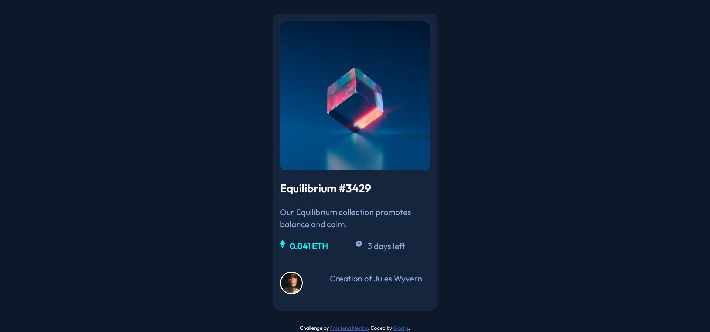

# Frontend Mentor - NFT preview card component solution

This is a solution to the [NFT preview card component challenge on Frontend Mentor](https://www.frontendmentor.io/challenges/nft-preview-card-component-SbdUL_w0U). Frontend Mentor challenges help you improve your coding skills by building realistic projects. 

## Table of contents

- [Overview](#overview)
  - [The challenge](#the-challenge)
  - [Screenshot](#screenshot)
  - [Links](#links)
- [My process](#my-process)
  - [Built with](#built-with)
  - [What I learned](#what-i-learned)
  - [Continued development](#continued-development)
  - [Useful resources](#useful-resources)
- [Author](#author)
- [Acknowledgments](#acknowledgments)

**Note: Delete this note and update the table of contents based on what sections you keep.**

## Overview

### The challenge

Users should be able to:

- View the optimal layout depending on their device's screen size
- See hover states for interactive elements

### Screenshot

Browser used: Firefox

### Links
- Live Site URL: ([Live site](https://linggladys.github.io/nft-preview-card-component-main/))

## My process

### Built with

- Semantic HTML5 markup
- CSS custom properties
- Basic flexbox
- Basic CSS Grid
- Constant Googling
- My hands

### What I learned

This more of a level-up version of the 1st challenge (the QR code). My output isn't exactly like the designs provided from this challenge.

### Continued development

It is pretty challenging to code for the colour overlay to occur as users hover over. There's still more space to learn and sharpen my CSS skills.
*

### Useful resources

- [Reset CSS](https://www.joshwcomeau.com/css/custom-css-reset/) - This is a good resource on customising reset CSS.
- [Overlay CSS when hover](https://www.w3schools.com/howto/howto_css_image_overlay.asp) - This is where I (kinda) have the inspiration from.

## Author

- GitHub - [Gladys](https://github.com/linggladys)
- Frontend Mentor - [@linggladys](https://www.frontendmentor.io/profile/linggladys)
